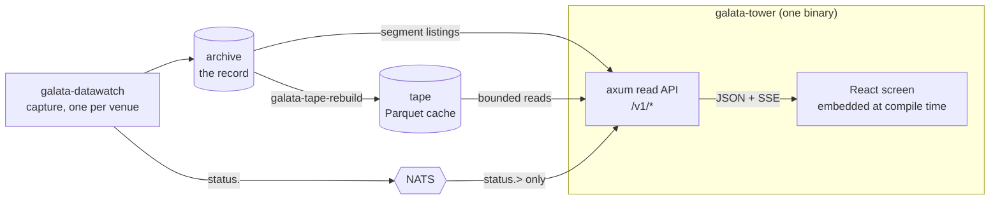
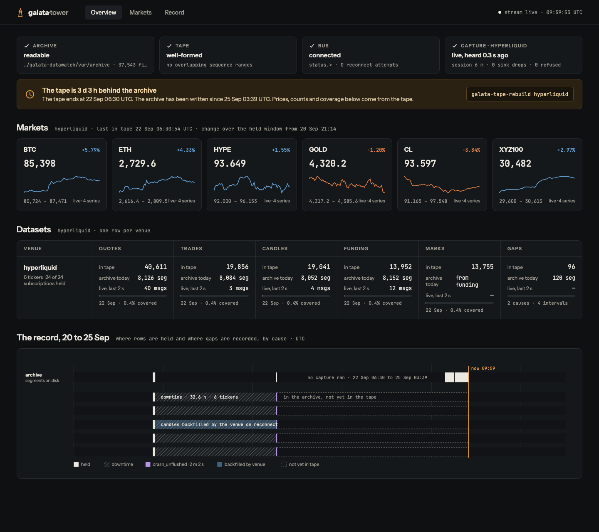
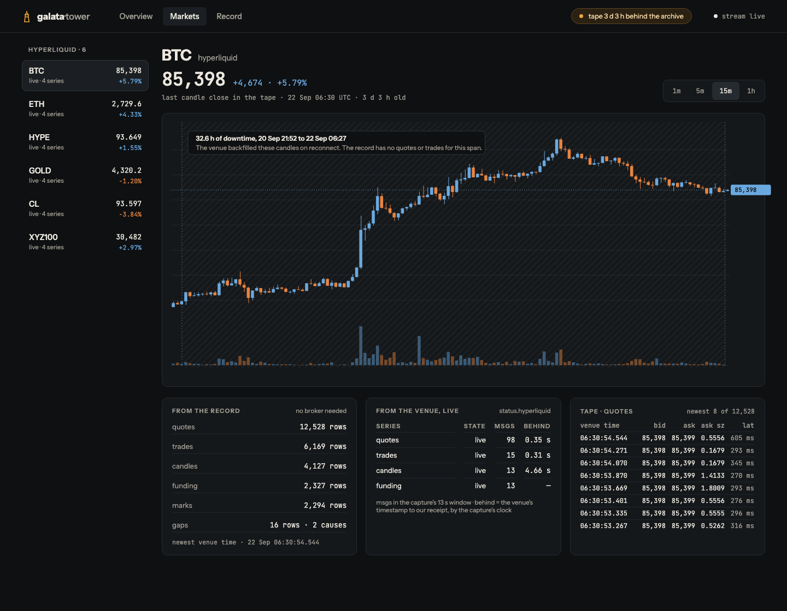
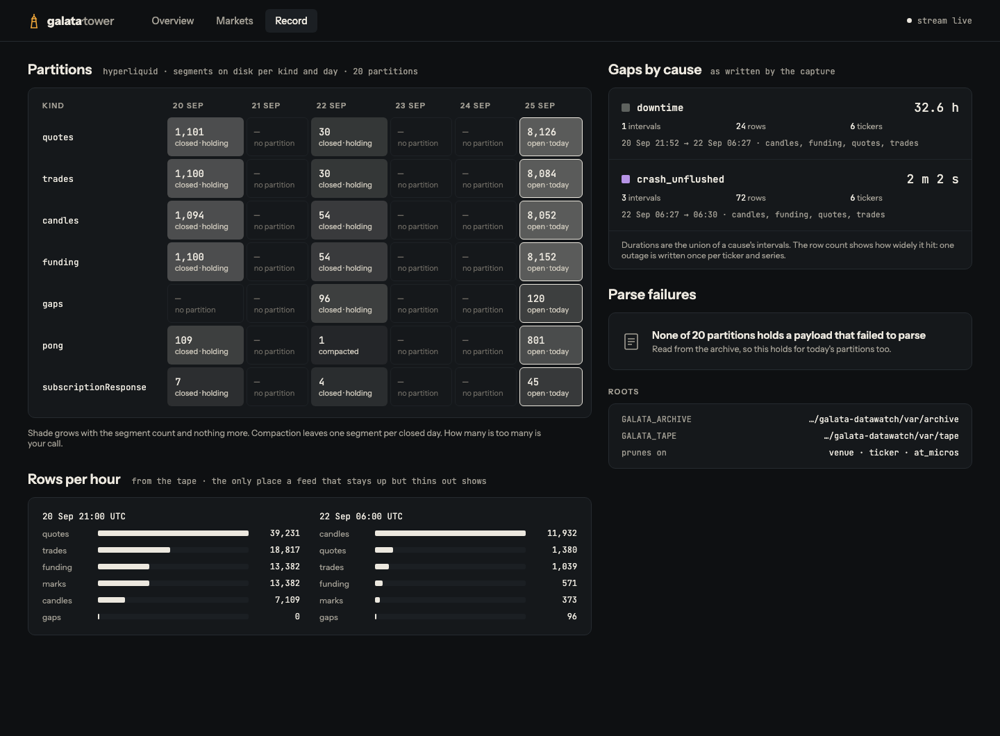
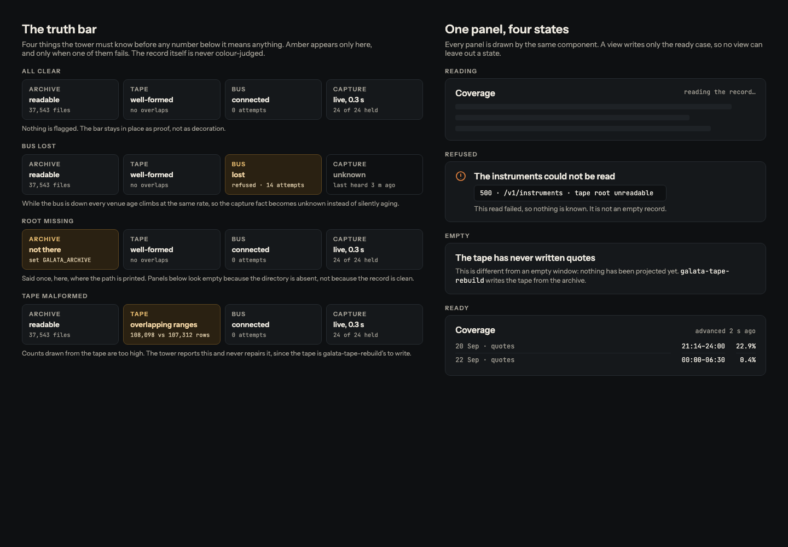

<picture>
  <source media="(prefers-color-scheme: dark)" srcset="assets/logo-on-dark.svg">
  
</picture>

# galata-tower

[](https://github.com/sercanatalik/galata-tower/actions/workflows/check.yml)
[](LICENSE-MIT)
[](rust-toolchain.toml)
[](https://github.com/tokio-rs/axum)
[](https://react.dev)

**The operator UI for Galata's market data: an axum read API over the record
and the React app it serves, in one binary.**

galata-tower shows what
[galata-datawatch](https://github.com/sercanatalik/galata-datawatch) has
captured: partitions, coverage, gaps, parse failures, ingest rates, every
instrument, a live tape, and each venue's own status. It answers from the
files on disk, not from what a capture process says about itself. It links no
capture loop, so it cannot be made to run one.

> **Status: 0.x.** The architecture is settled: the dependency wall, the
> generated contract, and what the tower is allowed to know. What it shows
> will keep growing.

---

## Contents

- [Where it fits in Galata](#where-it-fits-in-galata)
- [Features](#features)
- [Screenshots](#screenshots)
- [Quick start](#quick-start)
- [Configuration](#configuration)
- [HTTP API](#http-api)
- [Architecture](#architecture)
- [Development](#development)
- [Roadmap](#roadmap)
- [Licence](#licence)

---

## Where it fits in Galata

Galata is a low-latency algorithmic trading framework in Rust. It covers
multi-venue market data capture, signal generation, deterministic portfolio
risk controls, and agentic strategy execution driven by a fine-tuned decision
model. The tower is the operator's window onto it.



| It reads | Through | Never |
|---|---|---|
| the archive | `galata-segments` listings and the record's own datasets | writes, compacts or deletes |
| the tape | the bounded reader in `galata-datawatch`, with `default-features = false` | links a venue transport |
| the bus | `status.>` via `galata-broker`, with the `reader` identity | subscribes to `markets.>` |

The full framework architecture and roadmap are in the
[galata-datawatch README](https://github.com/sercanatalik/galata-datawatch#galata-at-a-glance).

---

## Features

| Panel | What it shows |
|---|---|
| **Live** | every venue's own account of itself and the broker's reachability, streamed over SSE |
| **Instruments** | every instrument the record holds, with its age and row count; no broker needed |
| **Partitions** | the partitions the record holds |
| **Closed, still holding** | closed days that still hold more segments than compaction would leave |
| **Candles** | charts over the tape's candles, drawn with `lightweight-charts` |
| **Gaps** | what the record says is missing, and why, by cause; overlapping gaps are unioned, not summed |
| **Failures** | payloads the record could not parse, grouped by error |
| **Coverage** | how much of each day the record holds, by dataset |
| **Rates** | rows per venue, dataset and hour |
| **Tape** | quotes, trades, candles, funding, marks and gaps, capped and newest first, with how far each venue is durable |

Each panel sits in its own error boundary, so one panel failing to render
says so in place and leaves the others working.

The screen does not poll. It refetches a panel only when the server says that
panel's data has moved (see [Live updates](#live-updates)), and each panel
shows how long ago its data last advanced, because a current table and an
hour-old one otherwise look identical.

---

## Screenshots

These are the redesign boards from the
[galata-tower redesign canvas](https://claude.ai/artifact/9T14pWbfdbE4FWPQ4fFH9y),
drawn on real data from 25 Sep 2026. They show where the screen is going, not
what `ui/dist` serves today.

**Overview.** The truth bar, the markets, the datasets per venue, and the
record's timeline with its gaps by cause.



**Markets.** One instrument's candles, with the downtime the venue backfilled
marked on the chart, beside what the record holds and what the venue says live.



**Record.** Partitions by kind and day, gaps by cause, parse failures, and rows
per hour.



**States.** The truth bar when each fact fails, and the four states every panel
can be in.



---

## Quick start

Requirements: Rust 1.98 (pinned by `rust-toolchain.toml`), and a checkout of
[galata-datawatch](https://github.com/sercanatalik/galata-datawatch) beside
this one. Node and pnpm are only needed to change the screen.

```sh
git clone https://github.com/sercanatalik/galata-datawatch
git clone https://github.com/sercanatalik/galata-tower
cd galata-tower

GALATA_ARCHIVE=../galata-datawatch/var/archive cargo run --release
# open http://127.0.0.1:8777
```

**The datawatch crates are path dependencies** until they are published to
crates.io, so the sibling checkout is required to build. After galata-datawatch
0.1.0 they become registry dependencies. `scripts/check-against-tarballs.sh`
already builds the tower against the packaged crates, to prove that switch
will work.

**The tower starts whether or not a broker answers.** The record is a fact on
disk and needs no bus to be true, so a refused connection is reported on the
screen and the record is still served.

---

## Configuration

All configuration is through environment variables:

| Variable | Default | Purpose |
|---|---|---|
| `GALATA_ARCHIVE` | `var/archive` | the datawatch archive root, e.g. `../galata-datawatch/var/archive` |
| `GALATA_TAPE` | `var/tape` | the tape root, which `galata-tape-rebuild` writes beside the archive |
| `GALATA_TOWER_LISTEN` | `127.0.0.1:8777` | the address to serve on |
| `GALATA_BROKER` | `127.0.0.1:4222` | the NATS server that carries `status.>` |

Both addresses default to loopback. Serving other machines, and reaching
another machine's bus, are deployment decisions, made by setting these
variables rather than assumed by the binary. In the reference deployment the
tower runs as the launchd agent `com.galata.tower`, installed by
galata-datawatch's `scripts/install-services.sh`, and reads its broker
password from galata-vault through a token minted for it alone.

---

## HTTP API

Every route answers from `galata-segments`' own listings and the record's
datasets:

```text
  GET /v1/about        the archive root, and the tape columns a read can prune on
  GET /v1/partitions   the partitions the record holds
  GET /v1/overdue      closed days still holding more segments than compaction left
  GET /v1/gaps         what the record says is missing, by cause
  GET /v1/instruments  every instrument the record holds, and when each was last seen
  GET /v1/failures     what the record could not parse, by error
  GET /v1/coverage     how much of each day the record holds, by dataset
  GET /v1/rates        rows per venue, dataset and hour, newest first
  GET /v1/status       live state, as server-sent events: venue status, the
                       broker's reachability, and when the record advances
  GET /v1/tape/{kind}  a window of one dataset, bounded by what is durable
```

- **Decimals are sent as strings.** Every price and size in the tape is
  `Decimal128(38, 18)` and is sent quoted (`"80770.000000..."`, not
  `80770.0`). As JSON numbers they would become doubles before the browser
  could refuse to round them. `arrow-json` writes them unquoted, which is why
  the tower serialises rows itself.
- **`/v1/overdue` reports and does not judge.** How many segments count as
  too many is the operator's threshold.
- The OpenAPI document is [`openapi.snapshot.json`](openapi.snapshot.json),
  and `galata-tower --dump-openapi` prints it from the serving binary.

---

## Architecture

```text
  crates/galata-tower/   the server: axum, utoipa, rust-embed
  ui/                    the React app; ui/dist is embedded at compile time
  openapi.snapshot.json  the API contract, generated and committed
  scripts/               the guards; check-all.sh runs them all
```

### It watches the record, not the worker

A heartbeat is a claim. A closed partition still holding 1,412 segments is a
fact on disk. The tower reports facts from the store and leaves judgement to
the operator.

### The dependency wall

The tower links **no capture loop**, and a guard checks it rather than a
comment claiming it:

```sh
./scripts/check-no-capture-loop.sh
```

`galata-datawatch` is taken with `default-features = false`. That one setting
removes **85 crates** from the tree (168 against 253, measured). The guard
reads `cargo tree -e features` and fails if the `capture` feature appears.

**The rule is "nothing that exists to talk to a venue", not "no async".**
`tokio`, `hyper` and `hyper-util` belong to axum. `rustls` arrives with
`galata-broker`, because NATS runs over TLS. The venue transports
(`tokio-tungstenite`, `tungstenite`, `reqwest`) are named as a second net, in
case one is added to the manifest directly. Both failure modes have been
planted and seen to fail.

`scripts/check-no-market-reach.sh` holds the other boundary: the tower
subscribes to `status.>` and nothing under `markets.`. A process that serves
a web page holds its broker password in its environment, and an identity that
can read every venue's firehose is not what an operator's laptop should
carry. The broker's grant enforces this on the server, and the guard fails a
subscription written here, rather than letting someone fix it by widening the
grant.

### The contract is generated, not written

```sh
./scripts/check-contract-drift.sh            # is the committed document what the code serves?
./scripts/check-contract-drift.sh --write    # refresh it, and the screen's types with it
```

`utoipa` derives the schemas from the response types and `utoipa-axum`
derives the paths from the routes, so each route is declared once. The
serving binary prints the document, which is committed as the reviewed
authority. `ui/src/contract/api.d.ts` is generated from it by
`openapi-typescript` and committed too, so the screen's types and the
server's have one source.

The predecessor did this by hand: 669 lines of TypeScript, a 233-line client,
and a fixture test whose own header admitted *"a field the server REMOVES
fails naming it, and a field it ADDS passes. One direction."* The generated
types are 165 lines, and a byte diff catches changes in both directions. The
guard regenerates twice and compares before trusting the diff, because a byte
comparison is only fair over a deterministic generator.

`scripts/check-documented-routes.sh` holds this README to the contract, in
both directions: an undocumented route fails, and so does a documented route
that is not served. It does the same for the environment variables the binary
reads.

### Live updates

The server reads each tape dataset's durable bound once a second and sends a
`tape` event only when one moves. The browser refetches that dataset when
told, and not otherwise. This was measured rather than assumed, against the
real tape:

```text
  open + bound   53µs      "has it grown?"
  full view      2.85ms    39,231 rows decoded
```

Asking is fifty-four times cheaper than reading, so the tower asks once, for
every browser, and does the expensive read only when the answer is yes.
`cargo run --release --example cost-of-a-bound` reproduces both numbers.

To watch the whole loop, give the tower a copy of the tape with its newest
segment held back, then put it back:

```sh
cp -R ../galata-datawatch/var/tape /tmp/tape-live
mv /tmp/tape-live/kind=quotes/date=*/s-*.parquet /tmp/held.parquet   # the newest one
GALATA_TAPE=/tmp/tape-live cargo run --release
# open the screen, note "durable to stream_seq …", then:
mv /tmp/held.parquet /tmp/tape-live/kind=quotes/date=2026-09-22/
```

The bound moves within a second and the Tape panel refetches, with no poll
and no reload.

**Don't time the "advanced Ns ago" counter from a background tab.** Chrome
throttles timers in hidden tabs, and a tab driven by automation is never
focused. The value is computed from `Date.now()` at render, so it is right
whenever it is drawn. Only how often it is redrawn changes.

---

## Development

```sh
./scripts/check-all.sh         # everything CI runs: guards, clippy, tests, the screen's tests
cargo test                     # the server's tests
cd ui && pnpm install && pnpm test    # the screen's tests (vitest, ~130 ms)
cd ui && pnpm dev              # the screen with hot reload
```

| Guard | Holds |
|---|---|
| `check-no-capture-loop.sh` | no capture loop or venue transport is linked |
| `check-no-market-reach.sh` | nothing subscribes under `markets.` |
| `check-contract-drift.sh` | the committed OpenAPI document and TypeScript types match the code |
| `check-documented-routes.sh` | this README names every served route and every variable read |
| `check-dist-drift.sh` | the committed `ui/dist` is the build of `ui/src` |
| `check-no-float-money.sh` | money is converted to a plotting number in exactly one file |
| `check-screen-tests.sh` | the screen's test suite runs in the gate |
| `check-against-tarballs.sh` | the tower builds against the datawatch crates as packaged, not just the checkout |

The screen's tests cover pure functions only: money parsing, the arithmetic
of the two clocks, why the screen is silent, and how a duration renders.
There is no jsdom. **What they cannot catch is a panel that computes
correctly and draws nothing.** That has happened: two panels once rendered
empty tables against a 33-hour-old tape, and a ticker selector offered one
instrument of six. Both were found by opening the browser, and that is still
the check for anything that renders. See [`ui/README.md`](ui/README.md) for
the screen.

---

## Roadmap

| Item | Status |
|---|---|
| Read API over the record: partitions, overdue, gaps, failures, coverage, rates, instruments | done |
| Generated OpenAPI contract and TypeScript types, with drift guards | done |
| React screen embedded in the binary, with no node process in deployment | done |
| Live venue status over SSE, and tape refetch driven by the durable bound | done |
| Durable bound reported per venue | done |
| Confirm the candle chart renders in a real browser (so far verified through the API only) | next |
| Switch to crates.io dependencies once galata-datawatch 0.1.0 is published | blocked on datawatch Tier 10 |
| Views for later Galata layers: research runs, signals, risk limits and execution state, each read-only and each added as that layer ships | planned |

The tower stays **read-only** across every phase. It reports what the record
and the bus say, and it never places, sizes or approves anything.

---

## Licence

MIT. See [LICENSE-MIT](LICENSE-MIT).
